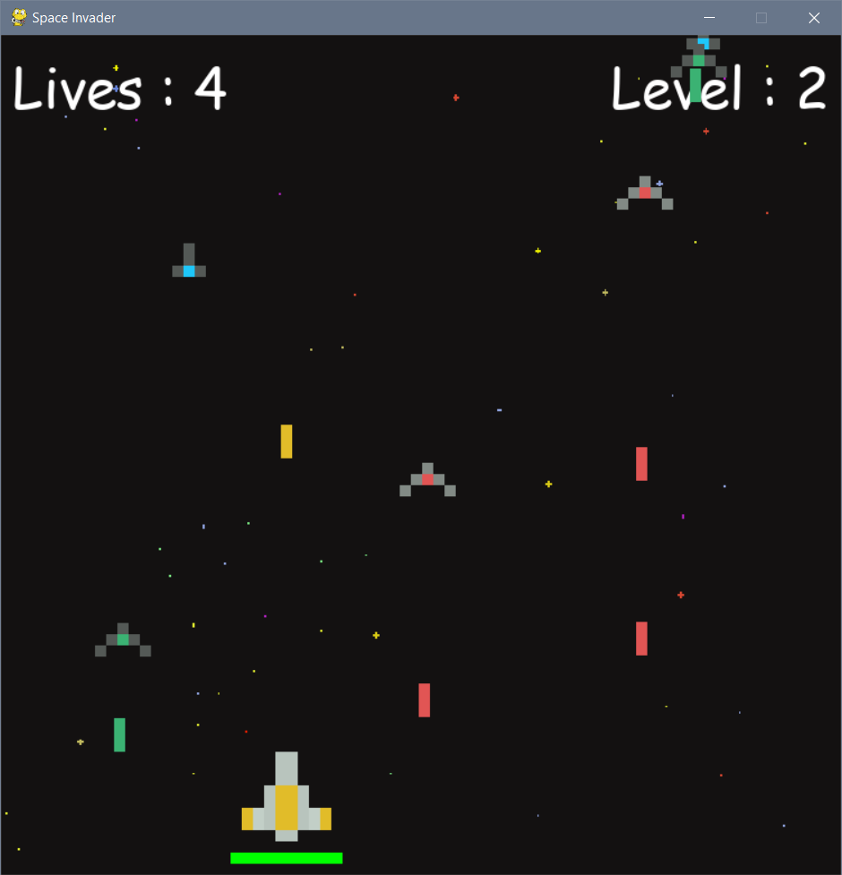

# Space Invader Game

## Description
A classic space shooter game implemented in Python using the Pygame library and Object-Oriented Programming (OOP) principles.

## Features
Player Controls:
   - Move the spaceship using W, A, S, D keys.
   - Shoot bullets using the space bar.
##

